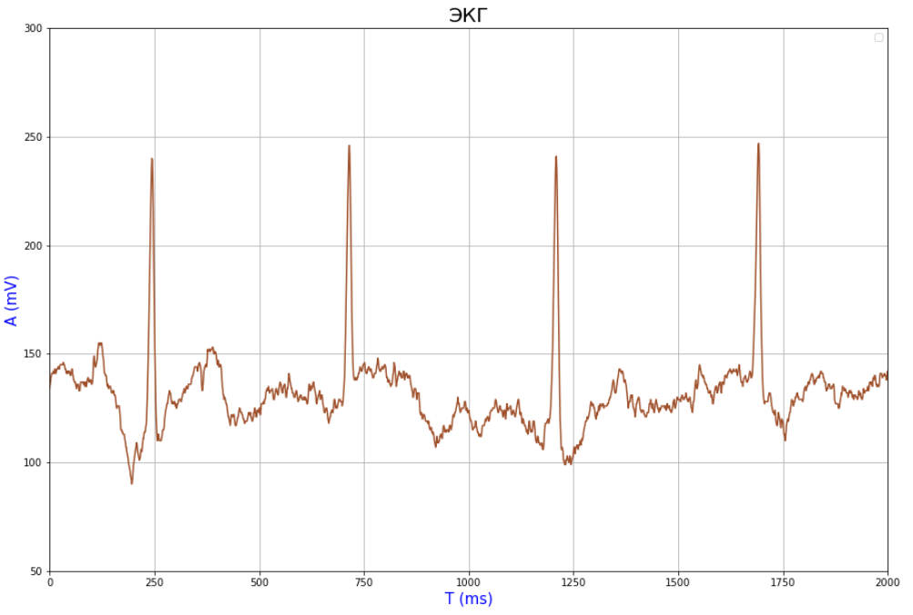
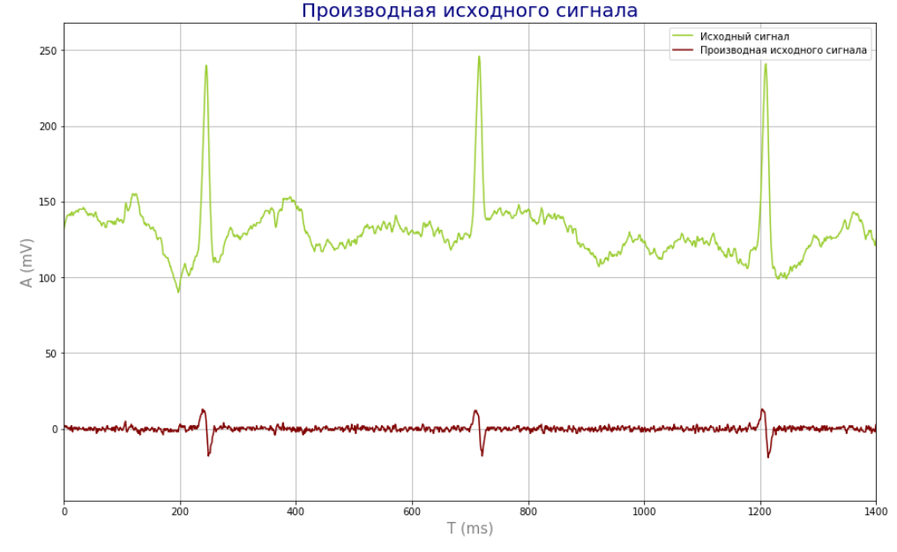
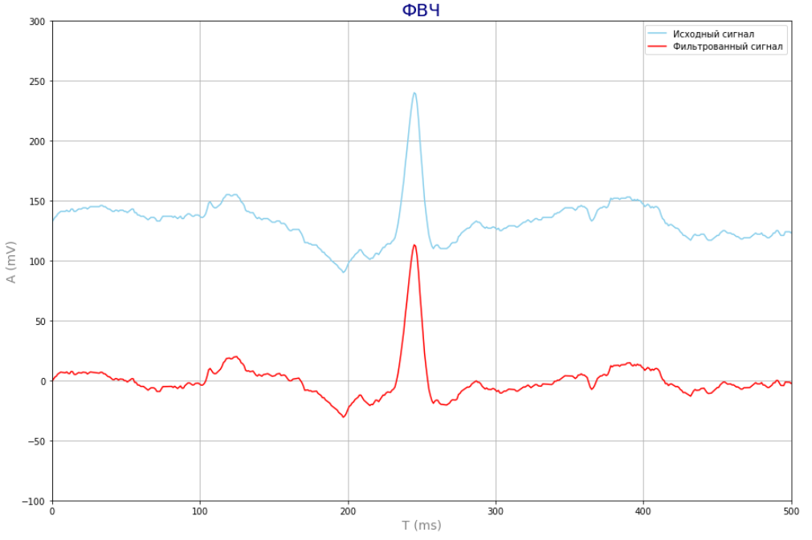
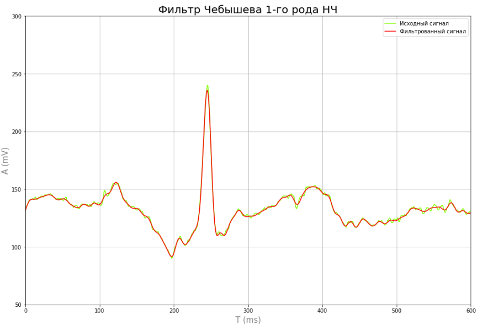
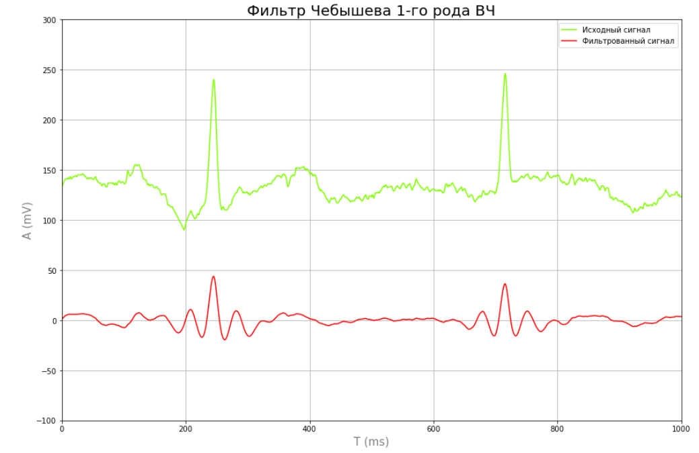
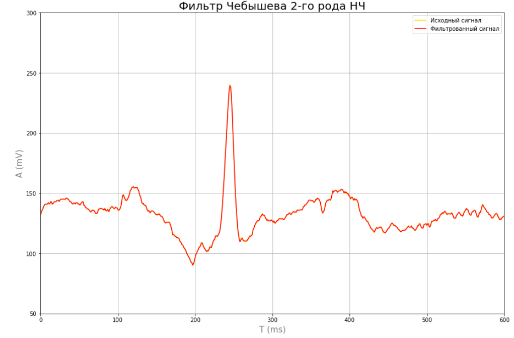
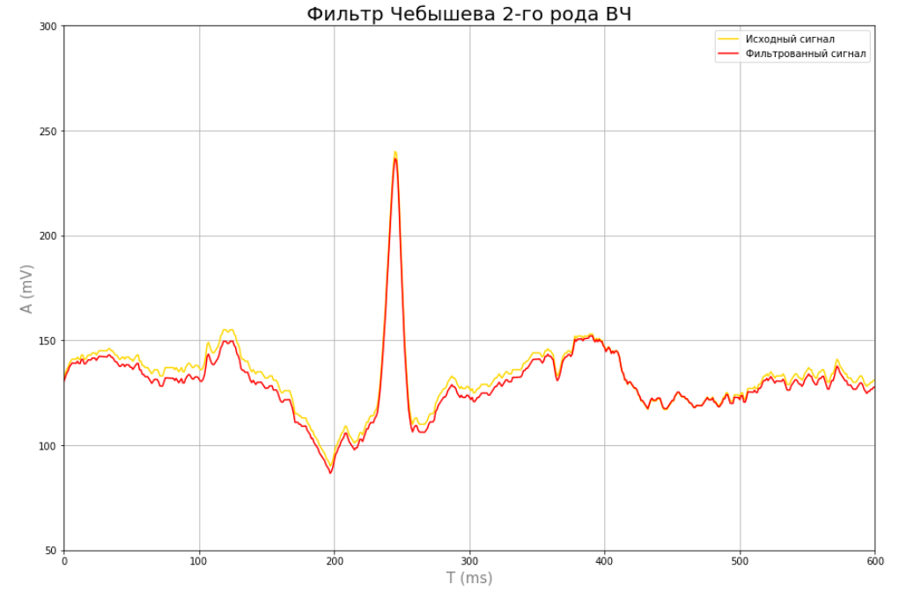
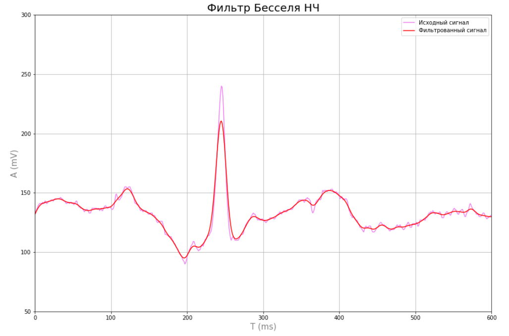
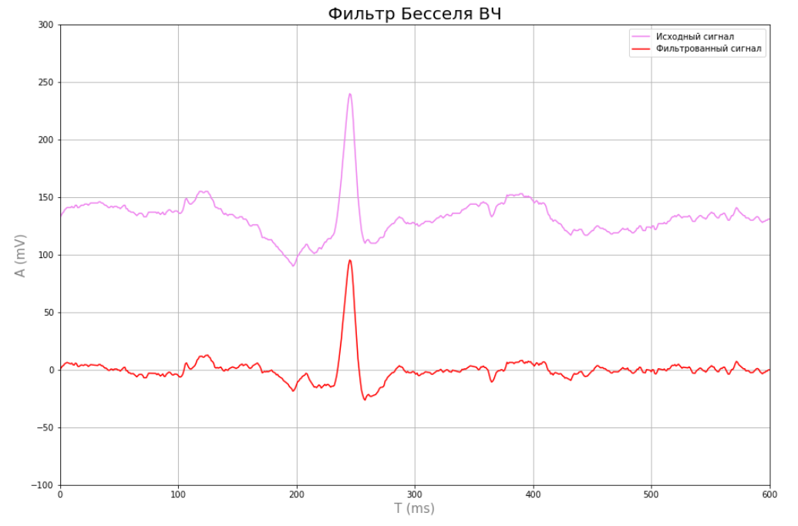
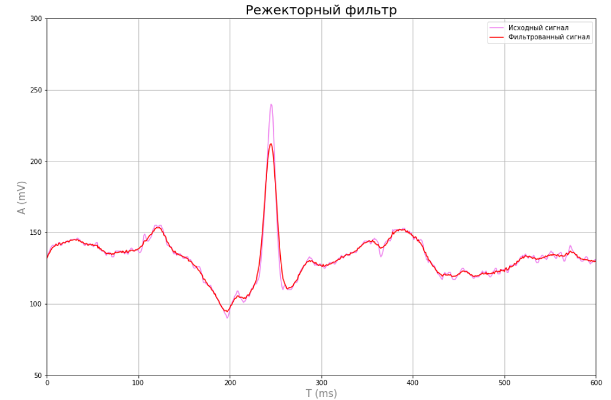

# Фильтрация биомедициснких сигналов в частотной области 

## Задание: 
1. Загрузить файл ecgX.txt, где X – номер Вашего варианта. Частота дискретизации ЭКГ сигнала составляет 500 Гц. Используя методы цифровой фильтрации добиться уменьшения интенсивности
присутствующих помех.

2. Сравнить эффективность фильтрации ЭКГ сигнала от присутствующих высокочастотных помех, используя различные типы ФНЧ (фильтр Баттерворта, фильтр Бесселя, фильтр Чебышева).
При фильтрации биосигналов использовать различные значения частоты среза и порядка фильтров с целью получения наилучшего результата фильтрации.

3. Применить режекторный фильтр для устранения периодических высокочастотных помех от сетевой линии, присутствующих на ЭКГ сигнале.

4. Сравнить эффективность фильтрации ЭКГ сигнала от присутствующих низкочастотных помех, используя различные типы ФВЧ (фильтр Баттерворта, фильтр Бесселя, фильтр Чебышева).

Исходный сигнал по варианту:

 

Реализация фильтра Баттерворда: ФНЧ (слева) и ФВЧ (справа): 

     
     

Реализация фильтра Чебышева 1 рода: ФНЧ (слева) и ФВЧ (справа): 

     
     

Реализация фильтра Чебышева 2 рода: ФНЧ (слева) и ФВЧ (справа): 

     
     

Реализация фильтра Бесселя: ФНЧ (слева) и ФВЧ (справа): 

     
     

Режекторный фильтр: 

 

Выводы: практически все фильтры НЧ смогли отфильтровать ВЧ-помехи, кроме фильтра Чебышева 2-го рода. 
Аналогичные результаты после действия ФВЧ - почти все фильтры убрали дрейф нуля у сигнала, фильтр Чебышева 2-го рода справился хуже всех.
Лучший результат показал фильтр Баттерворда на обоих фильтрах. Режекторный фильтр убрал помеху от сети 50 Гц. 
