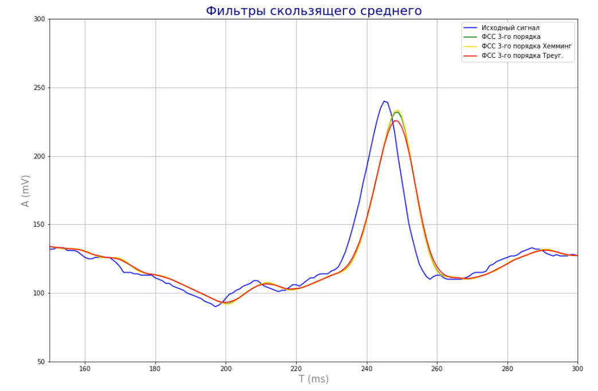
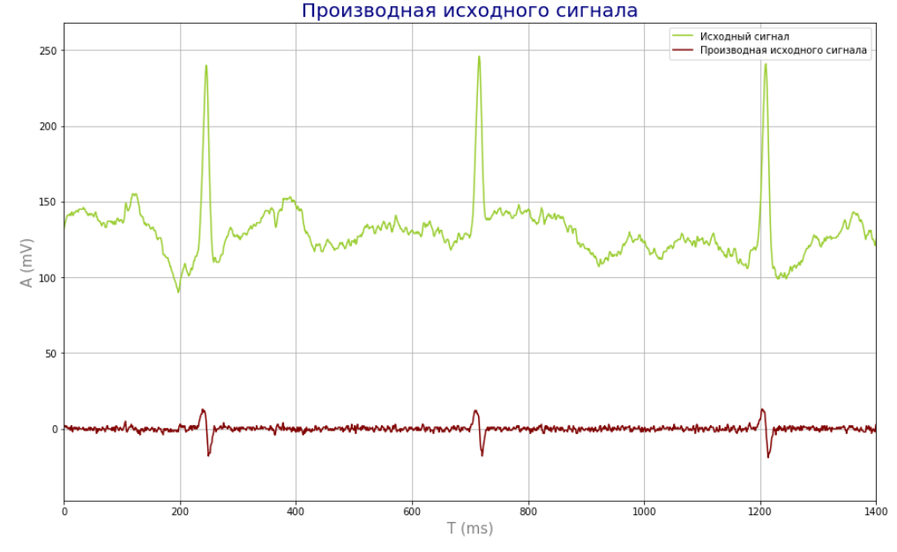

# Фильтрация биомедициснких сигналов во врмеенной области

## Задание: 

1. Загрузить файл ecgX.txt, где X – номер варианта. Частота дискретизации ЭКГ сигнала составляет 500 Гц. Используя методы
цифровой фильтрации во временной области добиться уменьшения интенсивности присутствующих помех.

2. Сравнить эффективность фильтрации ЭКГ сигнала от присутствующих высокочастотных помех, используя различные типы
фильтров скользящего среднего с целью получения наилучшего результата фильтрации.

3. Применить оператор первой производной для устранения низкочастотных артефактов, присутствующих на ЭКГ сигнале.

4. Оценить эффективность фильтрации ЭКГ сигнала с использованием фильтров во временной области в сравнении с частотными рекурсивными фильтрами.

Фильтр скользящегосреднего используется для фильтрации шумов квантования, ВЧ артефактов и помех, а также для сглаживания сигнала.

#### Фильтр скользящего среднего: 

 

#### Результат применения оператора первой производной: 

 

**Вывод:** при фильтрации скользящим окном уровень фильтрации сигнала зависит от размера окна. При выборе слишком большого размера окна может отфильтроваться большая часть полезного сигнала. 
Оператор первой производной можно применять для выделения R-зубцов кардиосигнала. Также оператор первой производной позволяет устранять НЧ артефакты, потсоянную составляющую и усиливать ВЧ компоненты и шумы. 
