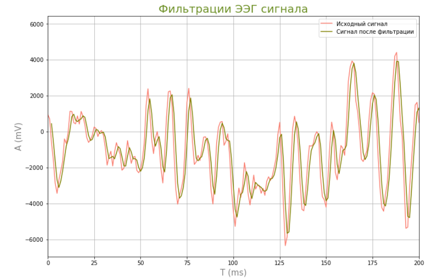

# 3. Корреляционная фильтрация биомедицинских сигналов

## Задание: 

1. Загрузить файл ecgX.txt, где X – номер варианта. Частота дискретизации ЭКГ сигнала составляет 500 Гц. Сформировать
эталонный образец одного кардиоцикла ЭКГ сигнала.

2. Используя метод корреляционной обработки сигналов провести цифровую фильтрацию зашумлённого ЭКГ сигнала.

3. Сравнить эффективность фильтрации ЭКГ сигнала на основе методов согласованной обработки с аналогичными результатами,
полученными с использованием фильтрации во временной области и частотной полосовой фильтрации.

4. Загрузить файл eegX.txt, где X – номер варианта. Частота дискретизации ЭЭГ сигнала составляет 250 Гц.
Сформировать эталонный образец комплекса спайк-волны.

5. Используя метод корреляционной обработки сигналов реализовать обнаружение комплексов спайк-волны в исходном ЭЭГ сигнале.

#### Перед тем, как сформировать эталонный образец выполним фильтрацию сигнала полосовым фильтром и скользящим средним: 

 

#### Просто используя срезы по массиву сформируем эталонный образец одного кардиоцикла: 

 

#### Выполним фильтрацию корреляционным фильтром: 

 

### Аналогичные процедуры выполним для электроэнцефалографического сигнала: 

#### Фильтрация ЭЭГ сигнала: 

 

#### Формирование эталонного образца спайк-комплекса: 

 

#### Фильтрация корреляционным фильтром ЭЭГ сигнала: 

 

